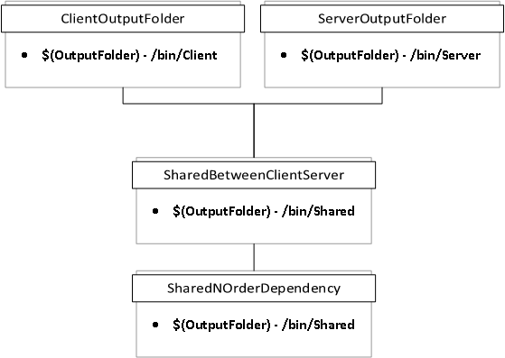

# MSBuildCopyLogic
This Toy repository is to try and find a way to accomplish the copying of dependent binaries between two distinct output locations using MSBuild.

Consider the following diagram:

The intent is to have 3 output folders with the following output:

1. `Client`
    - `ClientOutputFolder.dll`
    - `ClientOutputFolder.pdb`
    - `SharedBetweenClientServer.dll`
    - `SharedBetweenClientServer.pdb`
    - `SharedNOrderDependency.dll`
    - `SharedNOrderDependency.pdb`
2. `Server`
    - `ServerOutputFolder.dll`
    - `ServerOutputFolder.pdb`
    - `SharedBetweenClientServer.dll`
    - `SharedBetweenClientServer.pdb`
    - `SharedNOrderDependency.dll`
    - `SharedNOrderDependency.pdb`
3. `Shared`
    - `SharedBetweenClientServer.dll`
    - `SharedBetweenClientServer.pdb`
    - `SharedNOrderDependency.dll`
    - `SharedNOrderDependency.pdb`

The solution should be flexible enough to support any type of complex dependency tree utilizing `<ProjectReference>` to nest as required.

## How to use this repository
Each of the branches represent different approaches that have been tried along with why they have fallen short.

## Background
The requirements for this comes from a couple of places in our system. The design is such that we have several reusable components for our Micro-Services that need to be shipped for each individual Micro-Service, in addition we also have clients which can leverage these shared libraries.

Each of these represent a different deliverable and having the build system maintain these references would help greatly.[1](#f1)

In addition another use case is that in IIS Express does not support having a `/bin` folder that is not located directly beside the Project File[2](#f2)

Supporting 

## Footnotes
<b id="f1">1</b> Much of this is worked around today by hacks either in the MSI distribution process or batch files which are prone to code rot, especially as the complexity grows. [↩](#a1)

<b id="f2">2</b> There are several StackOverflow posts on this issue and various solutions, the most elegant winds up being to use a hardlink in Windows to trick the bin folder into looking in the correct location, however this still does not completely solve the issue when binaries exist in two output folders.

See:
- https://stackoverflow.com/questions/13263002/is-there-a-way-to-change-net-mvc-bin-dir-location
- https://stackoverflow.com/questions/28598196/iis-express-c-sharp-asp-dll
- https://stackoverflow.com/questions/1206138/how-do-i-reference-assemblies-outside-the-bin-folder-in-an-asp-net-application

[↩](#a2)